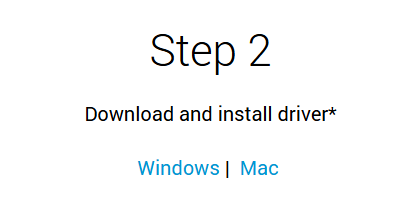
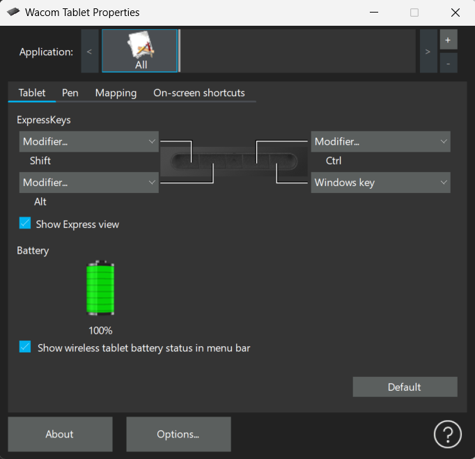
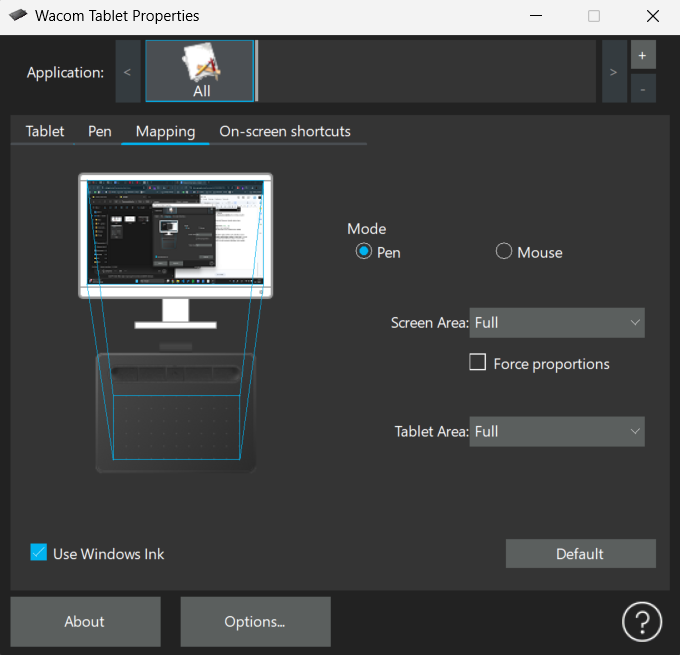

# 🔌 Zapojenie a nastavenie grafického tabletu

V tejto časti dokumentácie sa naučíme, ako správne zapojiť a nastaviť grafický tablet značky **Wacom**, konkrétne modely zo série **Wacom Intuos**.  
Celý návod je prispôsobený pre používateľov, ktorí s tabletom pracujú prvýkrát, a ukážky budeme demonštrovať na modeli **Wacom Intuos Bluetooth (veľkosť M)**.

Pre správne fungovanie tabletu je potrebné zabezpečiť nielen fyzické pripojenie k počítaču, ale aj nainštalovať oficiálny softvér a nakonfigurovať základné nastavenia ako je tlak pera, ovládacie tlačidlá či rozloženie pracovnej plochy.

---

## 🧰 Potrebné vybavenie
- Grafický tablet  
- USB kábel  
- Počítač so systémom Windows/macOS  
- Internetové pripojenie

---

## 🔗 Pripojenie tabletu

1. Pripojte tablet k počítaču pomocou pribaleného USB kábla.  
2. Počítač by mal tablet automaticky rozpoznať ako nové zariadenie.

> 💡 **Poznámka:** Pre prvé nastavenie je vhodné použiť USB kábel. Po úvodnej konfigurácii môžete prejsť na bezdrôtové používanie.

---

## 💽 Inštalácia Wacom ovládača

1. Navštívte stránku: [www.wacom.com/start](https://www.wacom.com/start)  
2. Vyberte model **Wacom Intuos**

3. Stiahnite si príslušný softvér podľa svojho operačného systému.  

4. Spustite inštaláciu a postupujte podľa pokynov.  
5. Po úspešnej inštalácii reštartujte počítač.

> 💡 Po nainštalovaní softvéru sa do systému pridajú dve aplikácie:
> - **Wacom Center** – riadiace centrum na správu zariadení  
> - **Wacom Tablet Properties** – nastavenia funkcií tabletu a pera

---

## ⚙️ Základné nastavenia tabletu

1. Otvorte **Wacom Center**  
2. V ľavom menu kliknite na svoj pripojený tablet  
3. Kliknite na tlačidlo **Pen settings**

Po otvorení Wacom Tablet Properties sa ako prvá zobrazí záložka Tablet, kde nájdete základné nastavenia pre hardvérové tlačidlá a informácie o batérii tabletu.

---

## 🎮 ExpressKeys – Prispôsobiteľné tlačidlá

Na tablete Wacom Intuos sú k dispozícii 4 hardvérové tlačidlá, ktoré môžete priradiť k ľubovoľným funkciám.

V tomto okne je možné každému tlačidlu priradiť klávesovú skratku alebo príkaz:

- `Shift` – výber viacerých objektov  
- `Ctrl` – často používané v kombinácii (napr. Ctrl + Z)  
- `Alt` – používané pri transformáciách  
- `Windows key` – otvorenie ponuky Štart alebo iných skratiek

### Battery – Stav batérie

- Ikona batérie ukazuje úroveň nabitia (zelená = plne nabité)  
- Zaškrtnutím možnosti **"Show wireless tablet battery status in menu bar"** sa bude stav batérie zobrazovať priamo na paneli úloh (Windows) alebo v hornom menu (macOS), čo umožňuje jednoduché a rýchle sledovanie aktuálnej úrovne nabitia.

---

## ✍️ Pen – Nastavenia pera

V ďalšej záložke Pen môžete prispôsobiť správanie pera podľa vlastných preferencií – od citlivosti na tlak až po funkcie jednotlivých tlačidiel

### Tip Feel – Citlivosť na tlak

Posúvač **Tip Feel** určuje, ako silno musíte pritlačiť na pero, aby sa zaznamenal ťah:
- **Soft** – reaguje na jemný dotyk  
- **Firm** – vyžaduje väčší tlak

> 💡 Nízka hodnota je vhodná pre jemné, precízne ťahy, vyššia pre kreslenie s výraznejším prítlakom.

### Current Pressure

Tento indikátor sa pohybuje v reálnom čase, keď pritláčíte na tablet.
Pomáha vizuálne pochopiť, ako pero reaguje na silu prítlaku pri kreslení

### Tip Double Click Distance

Nastavuje, aká vzdialenosť medzi dvoma ťuknutiami hrotu pera sa považuje za dvojklik.
Vyššia hodnota môže zjednodušiť dvojklik pohybom, ale znižuje presnosť.

> 💡 Odporúčaná hodnota pre kreslenie: **stredná alebo nižšia** (vyššia hodnota môže rušiť pri detailnej práci).

### Bočné tlačidlá na pere

Pero má zvyčajne dve bočné tlačidlá, ktoré si môžete priradiť podľa potreby:
- `Right click` – výborné ako náhrada pravého tlačidla myši
- `Scroll`, `Alt`, `Undo`, `Eraser` – ďalšie možnosti prispôsobenia
V tejto sekcii si môžete každé tlačidlo nastaviť z rozbaľovacej ponuky

> 💡 Odporúčané nastavenie pre začiatočníkov:  
> - 1. tlačidlo: **Right Click**  
> - 2. tlačidlo: **Undo (Ctrl + Z)**

---

## 🗺️ Mapping – Mapovanie tabletu

Záložka Mapping slúži na určenie, ako sa bude pohyb pera po tablete premietať na obrazovku počítača.

### Screen Area – Oblasť obrazovky

Určuje, akú časť obrazovky bude tablet ovládať.
Možnosti:
- **Full** – celý displej (odporúčané pri jednom monitore)
- **Portion** – len časť obrazovky (napr. horná polovica) 
- **Monitor 1 / 2** – výber konkrétneho monitora pri viacerých obrazovkách

> 💡 Ak používate viacero monitorov, odporúčame tablet namapovať len na jeden (napr. hlavný monitor), aby sa zachovala presnosť.

### Tablet Area – Aktívna časť tabletu

Môžete si vybrať, či chcete využívať celý povrch tabletu, alebo len určitú časť.

### Mode – Spôsob ovládania

- **Pen Mode** – presné mapovanie, vhodné na kreslenie  
- **Mouse Mode** – tablet sa správa ako touchpad, vhodné skôr na navigáciu

> 💡 Na digitálne kreslenie sa jednoznačne odporúča ponechať režim **Pen Mode.**

---

## ✅ Záver

Po absolvovaní tohto návodu by ste mali mať svoj grafický tablet Wacom Intuos správne nainštalovaný a nakonfigurovaný pre pohodlnú digitálnu kresbu. Ovládate základy práce s perom, viete si prispôsobiť tlačidlá, citlivosť a spôsob ovládania.

---

