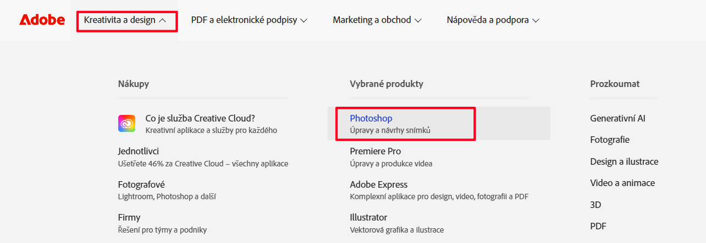
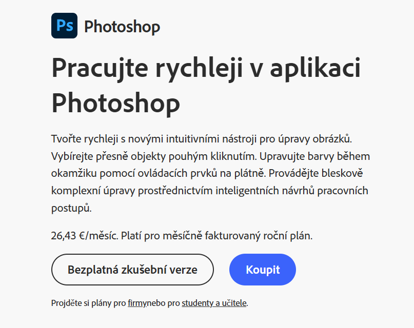
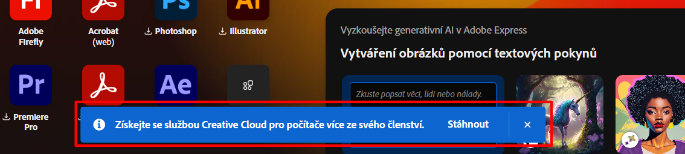
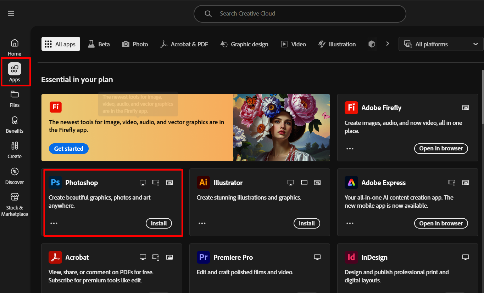
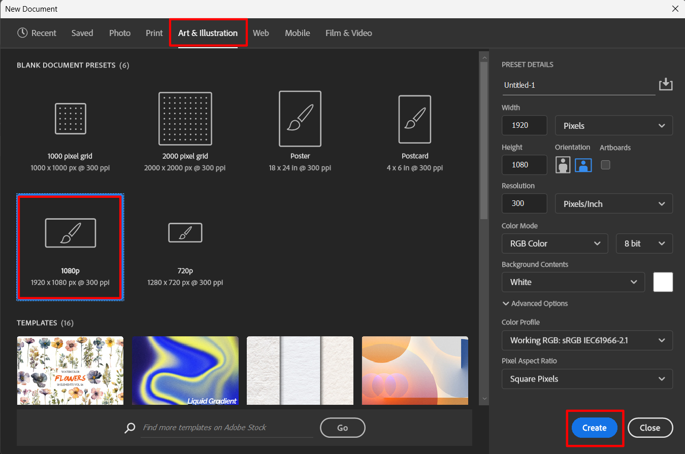
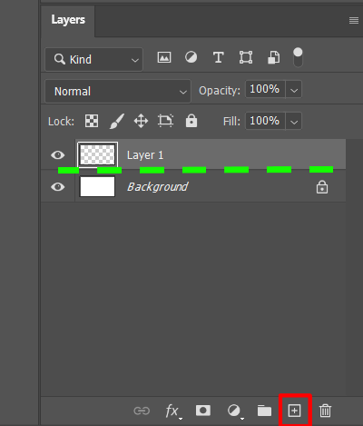
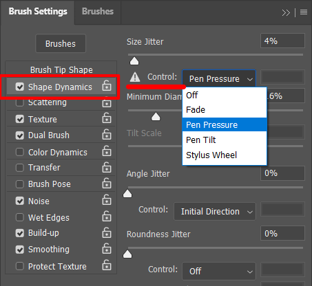
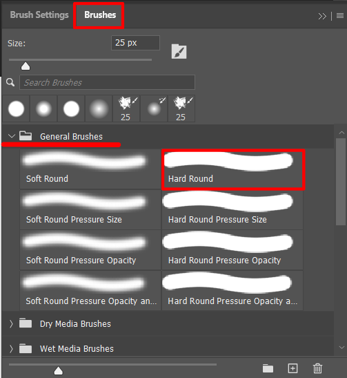

# Inštalácia Photoshopu a nastavenie na kreslenie

Tento návod vás krok za krokom prevedie inštaláciou Adobe Photoshopu a jeho základným nastavením pre digitálne kreslenie. Je určený najmä pre začiatočníkov a používateľov grafických tabletov, ktorí chcú začať s tvorbou digitálnej ilustrácie.

## 🧰 Potrebné vybavenie

- Internetové pripojenie  
- Adobe účet  
- Licencia alebo predplatné na Adobe Photoshop  
- Grafický tablet (napr. Wacom Intuos)  

## 💾 Inštalácia Adobe Photoshop

1. Navštívte stránku [www.adobe.com](https://www.adobe.com).
2. V menu **Kreativita a design** vyberte **Photoshop**.

3. Na výber máte dve možnosti:  
   - 30-dňovú **skúšobnú verziu zdarma**  
   - **Predplatné Adobe Photoshop**  

   > 💡 **Poznámka:** Photoshop je súčasťou predplatného **Adobe Creative Cloud** – môžete si zvoliť iba samotný Photoshop, alebo si aktivovať celý balík aplikácií (napr. Illustrator, Lightroom, atď.).

4. Prihláste sa do svojho Adobe účtu, alebo si vytvorte nový, ak ešte žiadny nemáte.
5. Stiahnite aplikáciu **Creative Cloud Desktop App**.

6. Po nainštalovaní a spustení Creative Cloud aplikácie:
   - Prejdite v ľavom panely na záložku **APPS**
   - Nájdite **Adobe Photoshop** a kliknite na **Install**

7. Po úspešnej inštalácii kliknite na **Open** a spustite aplikáciu.

## 🎨 Základné nastavenie Photoshopu pre digitálne kreslenie

### 🖼️ Vytvorenie nového dokumentu

1. Kliknite vľavo na **New File**.
2. V záložke **Art & Illustration** vyberte formát nového dokumentu:
   - **1920×1080 px**, **300 ppi**

3. V **ľavom dolnom rohu** vytvorte **novú vrstvu**, na ktorú budete kresliť.  
   
   💡 **Poznámka:** Práca s viacerými vrstvami umožňuje jednoduchšiu organizáciu a efektívnejšiu úpravu kresby.

### 🖌️ Aktivácia tlaku pera

1. V hornom menu kliknite na **Window > Brush Settings** (alebo stlačte `F5`).
2. Zobrazí sa vám panel s rôznymi možnosťami nastavenia štetcov.
3. Uistite sa, že je aktívna záložka **Shape Dynamics**.
4. V sekcii **Control** vyberte možnosť **Pen Pressure**.

 

💡 **Poznámka:** Týmto sa aktivuje **dynamická veľkosť štetca podľa tlaku pera na tablete**, čo je kľúčové pre prirodzene pôsobiacu digitálnu kresbu.

### 🖍️ Výber a nastavenie štetca

V rovnakom okne, na záložke **Brushes**, môžete vidieť rôzne priečinky so skupinami štetcov.  
Každý štetec si môžete prispôsobiť – napríklad upraviť jeho **veľkosť** podľa potreby pre kreslenie.

➡️ Na ukážku animovania vám postačí jednoduchý štetec:
- V priečinku **General Brushes** vyberte **Hard Round**

 

Vďaka týmto jednoduchým nastaveniam máte všetko pripravené na **vytváranie digitálnych kresieb** aj na **základnú animáciu obrázka**.  
Photoshop ponúka množstvo pokročilých možností, ale práve tieto základné kroky vám umožnia okamžite začať tvoriť.