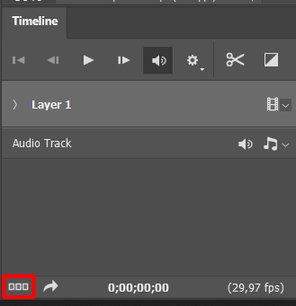
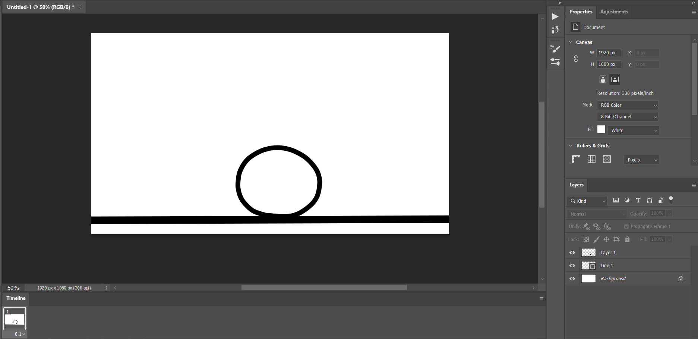
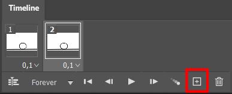
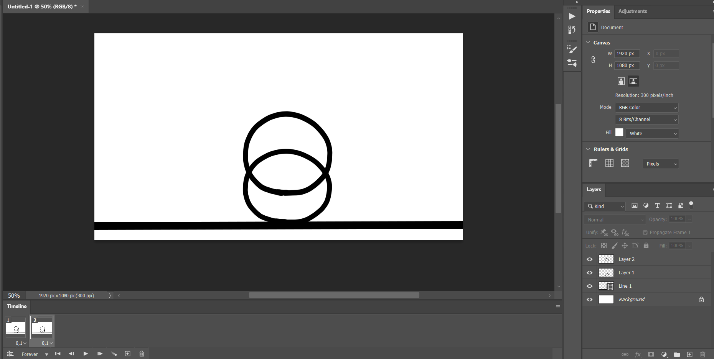
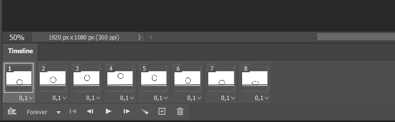

# 🎬 Vytvorenie digitálneho assetu a animovanie vo Photoshope

V tejto kapitole si ukážeme, ako v Adobe Photoshope vytvoriť jednoduchý digitálny asset a základnú **frame-by-frame** animáciu. Ako príklad budeme animovať **skákajúcu loptičku**.

## 🖼️ 1. Príprava časovej osi (Timeline)

1. V hornej lište kliknite na **Window > Timeline**.
2. V spodnej časti obrazovky sa zobrazí panel **Timeline**.
3. Kliknite na **Create Video Timeline**.
4. Kliknite na ikonu **tri bodky** vľavo a zmeňte režim na **Frame Animation**.

 
---

## 🎨 2. Vytvorenie objektu

1. Kliknite na prvý **frame**.
2. Nastavte **čas zobrazenia** tohto frame-u na **0.1 sekundy** (kliknutím na čas pod snímkou).
3. Na vrstve **Layer 1** nakreslite pomocou nástroja **Brush (klávesa B)** jednoduchý objekt – napríklad **loptičku**.

 
💡 **Poznámka:** Ak chcete čisté tvary, použite kombináciu s nástrojom *Ellipse Tool* alebo držte `Shift` pri kreslení.

---

## 🎞️ 3. Tvorba animácie

1. Kliknite na tlačidlo **Duplicate Frame** (ikona pri spodnom frame-e).

 

2. V novom frame-e vytvorte **novú vrstvu (Layer 2)** a nakreslite loptičku posunutú **mierne vyššie** – aby pôsobilo, že sa pohybuje nahor.

 

3. **Skryte vrstvy** podľa toho, ktorý frame je aktívny. Stačí ak kliknete na oko ktoré sa nachádza v ľavej časti vrstvy:
   - V **prvom frame** zobrazte **Layer 1**, skryte Layer 2.
   - V **druhom frame** zobrazte **Layer 2**, skryte Layer 1.

4. Rovnakým spôsobom pokračujte:
   - Vždy **duplikujte predchádzajúci frame**
   - **Vytvorte novú vrstvu** s loptičkou v mierne inej polohe
   - **Nastavte viditeľnosť vrstiev** pre daný frame

 
---

## ▶️ 4. Spustenie a export animácie

- Kliknite na **Play** v spodnej časti Timeline a pozrite si výsledok.
- Ak je animácia plynulá a spokojní ste s výsledkom, pokračujte na export:

### 💾 Export animácie

1. Choďte do **File > Export > Save for Web (Legacy)**.
2. Zvoľte formát **GIF**.
3. Nastavte:
   - **Looping Options**: Forever
   - **Preset**: GIF 128 Dithered (alebo podľa potreby)

4. Kliknite na **Save** a uložte animáciu.

---

## ✅ Záver

Pomocou tohto jednoduchého postupu ste si vyskúšali, ako sa tvoria základné frame-by-frame animácie v Photoshope.  
Aj takto jednoduchý príklad, ako je **skákajúca loptička**, vám umožní pochopiť princípy animácie a pripraviť si vlastné assety pre budúce projekty.
